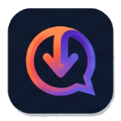

<div align="center">
  
  <h1>DownApp</h1>
  <p><em>The Next-Generation App Marketplace & Social Platform</em></p>

  <p>
    
    
    
    
  </p>
  <p>
    <a href="#english"><strong>🇬🇧 English</strong></a> · <a href="#türkçe"><strong>🇹🇷 Türkçe</strong></a>
  </p>
</div>

<hr />

<h2 id="english">🇬🇧 English</h2>

> **🎓 Academic Note:** DownApp was developed as a **Mobile Application Final Project**. It demonstrates full-stack capabilities, clean architectural patterns, and real-time database synchronization by blending an App Store with a Social Network.

### 🌟 Platform Highlights
DownApp redefines application discovery by making it a social experience.

| 🛒 **Marketplace** | 🌐 **Social Network** | 💬 **Real-Time** |
| :--- | :--- | :--- |
| Browse, search, and download Android apps directly. | Customizable profiles, activity feeds, and 24h stories. | Live SSE-based direct messaging with unread badges. |
| Verified developers can publish and manage updates. | Push notifications for interactions and friend requests. | Cross-platform deep linking between Mobile and Web. |

### 🛠️ Architecture & Tech Stack

- **Client:** Flutter (Dart) with `Riverpod` (State Management) and `GoRouter` (Navigation).
- **Web Mirror:** Vanilla JS (ES6+), HTML5, CSS3.
- **Backend:** PocketBase (Self-hosted SQLite, Real-time Subscriptions, Auth).
- **Pattern:** Domain-Driven Design (DDD) & Clean Architecture.

<details>
<summary><strong>🚀 Detailed Installation Guide (Click to Expand)</strong></summary>

#### 1. Prerequisites
- **Flutter SDK:** v3.11.0+
- **PocketBase:** Executable for your OS.
- **Node.js:** For serving the Web SPA.

#### 2. Backend (PocketBase) Setup
1. Run `./pocketbase serve` to start the local server.
2. Visit `http://127.0.0.1:8090/_/` to register your Admin account.
3. Open `pocketbase_setup.ps1`, update `YOUR_ADMIN_EMAIL` and `YOUR_ADMIN_PASSWORD`.
4. Run the script in PowerShell to automate the schema creation:
   ```powershell
   Set-ExecutionPolicy Bypass -Scope Process -Force
   ./pocketbase_setup.ps1
   ```

#### 3. Client Configuration
You must replace placeholder IPs so the app knows where the backend is:
- **Mobile:** Open `lib/core/network/pocketbase_client.dart` & `url_utils.dart`. Replace `YOUR_POCKETBASE_SERVER_IP` with your local IP (e.g., `http://192.168.1.X:8090` for physical devices or `http://10.0.2.2:8090` for emulators).
- **Web:** Open `downapp_web/src/api.js` and replace the API URL.

#### 4. Run the Platforms
**Mobile:**
```bash
flutter clean && flutter pub get
flutter run
```
**Web SPA:**
```bash
cd downapp_web
npx serve src
```
</details>

<hr />

<h2 id="türkçe">🇹🇷 Türkçe</h2>

> **🎓 Akademik Not:** DownApp, **Mobil Uygulama Bitirme Projesi** olarak geliştirilmiştir. Bir Uygulama Marketi ile Sosyal Ağı harmanlayarak; Clean Architecture (Temiz Mimari), gerçek zamanlı veritabanı senkronizasyonu ve full-stack yeteneklerini sergiler.

### 🌟 Platformun Öne Çıkanları
DownApp, uygulama keşfini sosyal bir deneyime dönüştürür.

| 🛒 **Uygulama Marketi** | 🌐 **Sosyal Ağ** | 💬 **Gerçek Zamanlı İletişim** |
| :--- | :--- | :--- |
| Android uygulamalarını keşfedin, arayın ve indirin. | Özelleştirilebilir profiller, aktivite akışı ve 24 saatlik hikayeler. | PocketBase SSE tabanlı canlı sohbet ve bildirim rozetleri. |
| Geliştiriciler kendi uygulamalarını platformda yayınlayabilir. | Arkadaş istekleri ve indirmeler için anlık push bildirimleri. | Mobil ve Web versiyonu arasında kesintisiz derin bağlantılar (Deep Links). |

### 🛠️ Mimari ve Teknoloji Yığını

- **İstemci (Mobil):** Flutter (Dart), `Riverpod` (Durum Yönetimi) ve `GoRouter` (Navigasyon).
- **Web (Ayna Sürüm):** Saf JavaScript (Vanilla JS), HTML5, CSS3.
- **Arka Uç (Backend):** PocketBase (SQLite, Canlı Abonelikler, Kimlik Doğrulama).
- **Tasarım Deseni:** Domain-Driven Design (DDD) tabanlı Clean Architecture.

<details>
<summary><strong>🚀 Detaylı Kurulum Rehberi (Genişletmek İçin Tıklayın)</strong></summary>

#### 1. Gereksinimler
- **Flutter SDK:** v3.11.0 veya üzeri.
- **PocketBase:** İşletim sisteminize uygun çalıştırılabilir dosya.
- **Node.js:** Web arayüzünü yerel sunucuda çalıştırmak için.

#### 2. Arka Uç (PocketBase) Kurulumu
1. Terminalde `./pocketbase serve` komutuyla sunucuyu başlatın.
2. `http://127.0.0.1:8090/_/` adresine girip ilk Yönetici (Admin) hesabınızı oluşturun.
3. Projedeki `pocketbase_setup.ps1` dosyasını açın; e-posta ve şifrenizi girin.
4. Tabloların (şemaların) otomatik kurulması için PowerShell'de şu komutu çalıştırın:
   ```powershell
   Set-ExecutionPolicy Bypass -Scope Process -Force
   ./pocketbase_setup.ps1
   ```

#### 3. İstemci (Client) Yapılandırması
Uygulamaların arka uca bağlanabilmesi için varsayılan IP adreslerini değiştirmelisiniz:
- **Mobil:** `lib/core/network/pocketbase_client.dart` ve `url_utils.dart` dosyalarındaki IP adresini yerel IP'nizle değiştirin (Fiziksel cihaz için `http://192.168.1.X:8090`, Emülatör için `http://10.0.2.2:8090`).
- **Web:** `downapp_web/src/api.js` dosyasındaki API URL'sini güncelleyin.

#### 4. Platformları Çalıştırma
**Mobil (Flutter):**
```bash
flutter clean && flutter pub get
flutter run
```
**Web SPA:**
```bash
cd downapp_web
npx serve src
```
</details>

<br />

<div align="center">
  <sub>Developed by **Yusuf** with ❤️ for educational purposes. Licensed under MIT.</sub>
</div>

